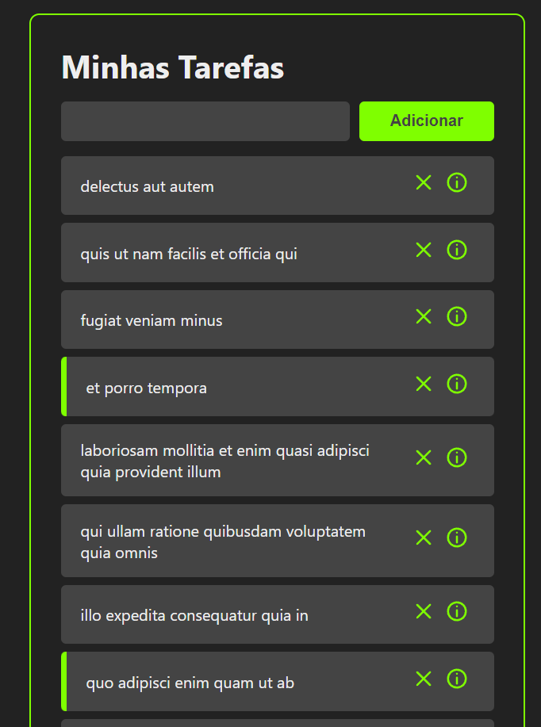
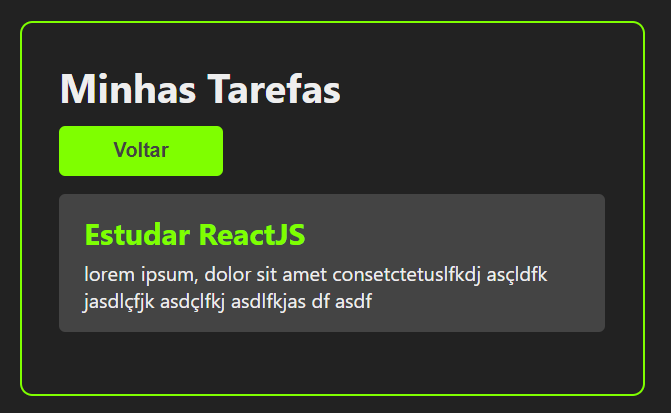
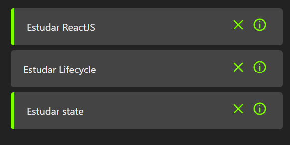

<h1 align="center">Task Manager</h1>

    
Gerenciador de tarefas utilizando ReactJS

    

    

        <a href="#objetivo">Objetivo</a> •
        <a href="#tecnologias">Tecnologias</a> •
        <a href="#features">Features</a> •
        <a href="#autor">Autor</a>
    

    <h2>Objetivo</h2>
    
Primeiro projeto utilizando ReactJS com fins de aplicar os conhecimentos sobre SPA; reutilização de componentes; state; hooks e restAPI com axios

    <h2>Tecnologias</h2>
    

        
        
        
        
        
    

    

        <h2>Preview</h2>
        <table>
            <tr>
                <td>Página inicial - tarefas</td>
                <td>Informações de uma tarefa</td>
                <td>Marcação das tarefas concluídas</td>
            </tr>
            <tr>
                <td></td>
                <td></td>
                <td></td>
            </tr>
        </table>
    

    

        <h2>Features</h2>
        <ul>
            <li>[x] Criar Tarefa</li>
            <li>[x] Deletar Tarefa</li>
            <li>[x] Checar informações de uma Tarefa</li>
            <li>[x] Marcar conclusão de uma Tarefa</li>
        </ul>
    

 

     <kbd>
    <h2>Autor</h2>
    

        
        
         
    

        <a href="https://github.com/vitu1928">
            
             
            <b>Victor T.</b>
        </a>
    

         
        
        
        </kbd>
    

